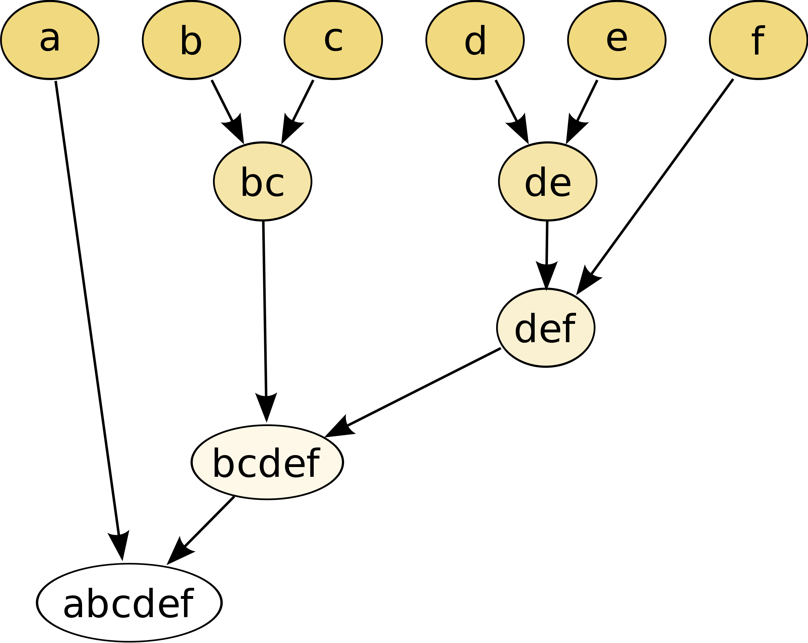
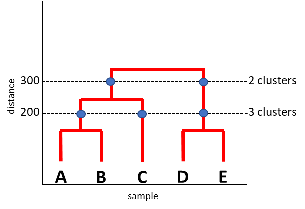
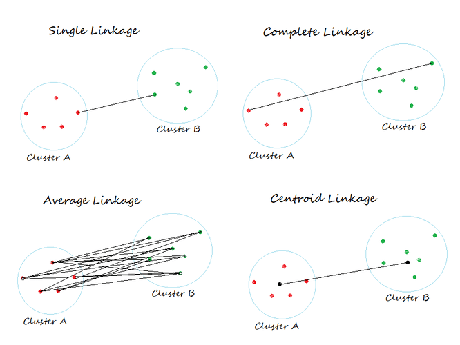
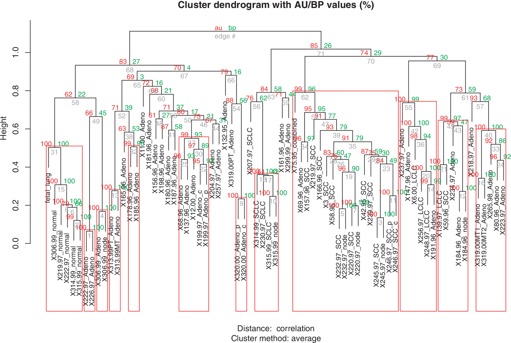

# Practical Tutorial: Clustering
 
For those interested in clustering, and specifically in the most common algorithms, hierarchical clustering and k-means clustering,
here is a practical guide that I think many of you will find useful. It was created during my stay in [Prof. Rainer König lab](https://www.uniklinikum-jena.de/infektionsmedizin/Forschung/Modelling.html) and represents my updated version of the lab's tutorial for the annual R course. My solution for the tasks is provided as an attached .R file. Enjoy!

## Introduction

***Hierarchical clustering.*** Hierarchical clustering leads to a nested structure of clusters: larger clusters contain smaller ones.
The agglomerative method starts with small clusters, which contain exactly one object (singletons). Subsequently, the clusters 
are merged into the bigger ones until the stop criterion is fulfilled.




Typical example of the hierarchical cluster analysis results ([*source*](https://www.sciencedirect.com/science/article/pii/B9780128145623000059))
(A) The typical outcome of cluster analysis is a graph where data are progressively grouped together. This plot is called a dendrogram.
The clustering distance shows the hierarchy of clustering, namely data clustered at short distances have a larger similitude among 
them, in respect to the others clustered at a large scale. (B) The concept of cluster hierarchy is clearly visible when clusters 
formed at two different scales are plotted in the features space. Obviously clusters at a larger scale are inclusive of those 
occurring at smaller scales. (further information see: [short video](https://www.youtube.com/watch?v=7xHsRkOdVwo))

***k-means clustering.*** When the number of clusters is fixed to *k*, *k*-means clustering gives a formal definition as an optimization
problem: find the *k* cluster centers and assign the objects to the nearest cluster center, such that the squared distances from 
the cluster are minimized. The figure below shows the *k*-means algorithm in action ([*source*](https://aman.ai/cs229/kmc/)). 
Training examples are shown as dots, and cluster centroids are shown as crosses.



(a) Original dataset. (b) Random initial cluster centroids (in this instance, not chosen to be equal to two training examples). (c-f) Illustration of running two iterations of *k*-means. In each iteration, we assign each training example to the closest cluster centroid (shown by “painting” the training examples the same color as the cluster centroid to which is assigned); then we move each cluster centroid to the mean of the points assigned to it.

(further information see: [short video](https://www.youtube.com/watch?v=4b5d3muPQmA))


**Further video links:**

&nbsp;&nbsp;&nbsp;[Clustering: *k*-means and Hierarchical](https://www.youtube.com/watch?v=QXOkPvFM6NU)


Other types of clustering, not covered in the tutorial:

&nbsp;&nbsp;&nbsp;[DBSCAN clustering](https://www.youtube.com/watch?v=RDZUdRSDOok)

&nbsp;&nbsp;&nbsp;[t-SNE clustering](https://www.youtube.com/watch?v=NEaUSP4YerM)

## Practical Part

**Data**

The dataset with 4,345 genes and 43 experimental samples is used. It is a real study that investigated the expression of *E.coli*
 in aerobic and anaerobic growth media. For details and the original files, see [*Covert, M.W. et al. (2004). Nature, 429, 92-96*](https://www.nature.com/articles/nature02456). 

For the analysis, download the gene expression table "covert.withsymbols.log.Dec05.tab" from the repository to your diretory.

**Import**

Make sure that the packages “pvclust” and “gplots” are installed. If not, you can install these packages with the function 'install.packages()':
```r
install.packages("pvclust", dependencies = TRUE)
```

Import the packages with the function 'library()':
```r
library(pvclust)
```

Import the data to be analysed, "covert.withsymbols.log.Dec05.tab" file:
```r
setwd(“ … a path to the newly created folder … “)
matrix.org <- read.table(<file>, <additional parameters i.e. “sep”, “header”,...>)
```

**Pre-processing**

In order to reduce complexity, before the actual clustering, we perform a gene selection (“feature selection“).
The aim is to select only genes with potentially relevant information. These genes are selected according to their mean
expression and standard deviation.


First, we want to exclude genes, which show only a slight variance of expression in the dataset. Thus, we calculate the standard deviation:
```r
variance <- apply(matrix.org, MARGIN = 1, FUN = sd)
```

Rank the genes according to their standard deviation and save the plot in .png file:
```r
variance.rank <- rank(1/variance)
png(filename = "variance.png", width = 35, height = 20, units = "cm", res = 300)
plot(variance.rank, variance, xlab = "Genes", ylab = "Standard Deviation")
dev.off()
```
Note: here and later in the tutorial, in order to save a graph in the .png file, the 'plot()' function has to follow the opening 
function 'png()' and to be followed by the closing function 'dev.off()'.


We are also interested in genes, which have a higher expression. Therefore, we determine the mean expression for each gene:
```r
mean.expression <- apply(matrix.org, 1, mean)
```

Order the genes according to their expression and save the plot in .png file (instructions see above, don’t forget to change the file name):
```r
int.rank <- rank(1/mean.expression)
plot(int.rank, mean.expression, xlab = "Genes", ylab = "Expression")
```

The clustering algorithm is faster if a smaller set of genes is used. We will select a set of genes by using a variance and 
expression filter. The command ‘which()’ yields the positions, in which the Boolean expression is TRUE:
```r
variance.sel <- which(variance > quantile(variance, 0.50))
expression.sel <- which(mean.expression > quantile(mean.expression, 0.50))
```

Select those genes, which fulfil both criteria:
```r
gene.sel <- intersect(variance.sel, expression.sel)
matrix.sel <- matrix.org[gene.sel, ]
```

Plot the expression of the genes versus the standard deviation and highlight the selected genes. Save the plot in .png file (instructions see above, don’t forget to change the file name):
```r
plot(mean.expression, variance, xlab = "Expression",ylab = "Standard deviation", pch=".")
points(mean.expression[gene.sel], variance[gene.sel], col = "red", pch="+", cex = .7)
```

How many genes are left after filtering? Are the commands of the filtering step clear? What does the parameter “0.50” in the 
'quantile()' function mean? Change this parameter, so that less than 200 genes are selected.


**Hierarchical clustering**

First, we will cluster samples. We can choose from various linkage methods and distance measures. For this exercise, we will use the 
method „Average Linkage“ (UPGMA) and the distance measure „Euclidean Distance“. If you want, you can test other options,
such as, for example, "Single Linkage" method. [Consult the internet](https://en.wikipedia.org/wiki/UPGMA#Comparison_with_other_linkages) in order to find out differences between linkage methods and 
to explain the various dendrogram results. Here is a graphical hint (distance measures are shown with the black lines):



```r
method <- "average"
distance <- "euclidean"
```

Now, we apply the hierarchical clustering to the given microarray datasamples and display the associated dendrogram:
```r
clustering <- hclust(dist(t(matrix.sel), method = distance), method = method)
plot(clustering)
``` 
Note: save the plot in .png file (instructions see above, don’t forget to change the file name)

Which samples cluster together? Does this make sense?

We can define the numbers of clusters we want to have. Split the dendrogram into 4 clusters and obtain the members of each cluster:
```r
groups <- cutree(clustering, 4)
samples <- colnames(matrix.sel)
for (i in c(1:4)) {
  print(samples[groups == i])
  print("--------------------")
}
```

Instead of clustering samples, we can apply the clustering method to the genes and use the heatmap representation to see if there are similar expression patterns.
But be aware that the associated dendrogram can become quite large and hence hard to interpret.

Plotting a heatmap and save the plot in .png file (instructions see above, don’t forget to change the file name):
```r
heatmap.2(as.matrix(matrix.sel), Rowv=TRUE, Colv=as.dendrogram(clustering), key=TRUE, scale="row", col = redgreen(75), symkey=FALSE, density.info = "histogram", trace="none", labRow=FALSE)
```
Note: If you select only a few genes for the heatmap you can view them by switching ‘labRow’ from FALSE to the vector of those gene names.


**Cluster stability**

Because of the high variance of microarray data, it is hard to estimate whether the determined cluster structure is stable. Therefore, we use the R package ‘pvclust’. Based on a bootstrapping approach, this method calculates a p-value for each cluster of the dendrogram. In this approach, many datasets are “generated” by repeated drawing from the existing data (The data are drawn by bootstrapping or “sampling with replacement”. Consequently, we can draw a dataset multiple times).
If these many datasets generate the same clusters, then the clusters are “robust”. Here a significance value (a p-value) is provided at the end of the clustering procedure. The p-values for a cluster can reach values between 0 and 1 (0% – 100%). These p-values give an estimate how robust the clusters are supported by the data.



Please note, ‘pvclust()’ provides two types of p-values (in %): **au** (Approximately Unbiased) p-value and **bp** (Bootstrap Probability) value. Au p-value, which is computed by multiscale bootstrap resampling, is a better approximation to unbiased p-value than bp value computed by normal bootstrap resampling.

We will apply this clustering method as we did before with the samples. Check the stability of the clusters:
```r
set.seed(5)
pv <- pvclust(matrix.sel, method.hclust=method, method.dist=distance, nboot = 10)
```
Note: 'setseed()' function ensures that we get the same result each time we run the code. You can choose any integer.


Set the threshold for p:
```r
p.value <- 0.05
```
Note: the threshold alpha = 1 – p = 0.95 means, that this cluster is built in 95% of the datasets. That is why this cluster is considered significant.


Draw the dendrogram including the cluster stability and highlight the stable clusters with a red box. Save the plot in .png file (instructions see above, don’t forget to change the file name):
```r
plot(pv)
pvrect(pv, alpha= 1-p.value)
```
Check the clustering of the samples! Can you figure out some outliers? If so, try to remove these from your data set and repeat this section!
Hint: You can search a sample with the following command:
```r
grep("<..pattern..>", colnames(matrix.sel))
```

After identifying columns of outliers (e.g. 'number_col_1' & 'number_col_2'), we can remove them from the analysis:
```r
number_col_1 <- ...
number_col_2 <- ...
new.matrix <- matrix.sel[,-c(number_col_1, number_col_2)]
```
Note: to select the correct columns, instead of just a number try to use a more smart boolean expression.

In the previous step, we have evaluated the stability of the sample clusters. Now we want to check the stability of the gene clusters. In the next step, these results undergo a functional analysis.

Test the stability of the gene cluster:
```r
set.seed(5)
pv <- pvclust(t(matrix.sel), method.hclust = method, method.dist = distance, nboot = 10)
```

Select stable clusters:
```r
pv.pp <- pvpick(pv, alpha = 1-p.value)
```

How many clusters are considered as stable (*k* = number of stable clusters)? Answer:
```r
k <- length(pv.pp$clusters)
print(k)
```

Please consider that a low number of bootstraps (see ‘nboot’ parameter of the ‘pvclust()’ function) doesn’t return a reliable result.
You will observe that the number of stable clusters is different when repeating the clustering of the genes a couple of times.
You can avoid this, by increasing the nboot parameter to i.e. 100 or 1000 (but the clustering also takes much longer!).
```r
# Not to run (!!!):
#pv <- pvclust(t(matrix.sel), method.hclust = method, method.dist = distance, nboot = 100)
```

**Interpretation (functional analysis)**

Choose one of the *k* stable clusters, for example cluster 1. Or, better for the practical course, select the clusters from ‘hclust()’
if ‘pvclust()’ was too slow on your computer.

Using ‘pv.clust()’ (but use ‘pv.clust()’ with at least n=100 bootraps):
```r
cluster.sel <- 1
```

Display the gene names of the chosen cluster:
```r
pv.pp[[1]][[cluster.sel]]
```

Or, better, when using ‘hclust()’:
```r
clustering.genes <- hclust(dist(matrix.sel, method = distance), method = method)
plot(clustering.genes)
groups <- cutree(clustering.genes, k=2)
gene <- rownames(matrix.sel)
genes_cluster <- gene[!groups == cluster.sel] 	# Note: group numbers are different in 'pvclust()'
print(genes_cluster)
```
Note: Save the plot in .png file (instructions see above, don’t forget to change the file name).

*Optional*:
Look at the clusters and figure out in the internet, whether the stable clusters are functional relevant clusters (Why are the genes
in the same cluster?). Here are some ideas: 
-	Search for the gene names in Pubmed
-	Biological functions and pathways of the genes


**k-means clustering**

In the step above we have defined the hierarchical clustering object: 
```r
clustering <- hclust(dist(t(matrix.sel), method = distance), method = method)
```

Now, let's set the number of clusters to 2 and perform *k*-means clustering for all samples:
```r
number_of_clusters <- 2
set.seed(5)
km <- kmeans(t(matrix.sel), centers = number_of_clusters)
table(km$cluster)
```

Mark the clusters of the *k*-means method with different colors (see ‘my.col’ vector) and compare them with the clusters of the hierarchical clustering method. Can you figure out some differences? 
```r
my.col <- palette()[2:3]
col <- my.col[as.vector(km$cluster)]
samp.col <- col[order(km$cluster)]

heatmap.2(as.matrix(matrix.sel), Rowv = FALSE, Colv = as.dendrogram(clustering), scale = "row", dendrogram = "col", ColSideColors = samp.col, col = redgreen(75), density.info = "histogram", trace = "none", labRow = FALSE)
```
Note: Save the plot in .png file (instructions see above, don’t forget to change the file name)

Repeat this section and try out different number of clusters for *k*-means. Try take the number of experimental conditions in the 
dataset into account (see the original article and its supplementary data). For more colors, you can use:
```r
my.col_25 <- c( "dodgerblue2", "#E31A1C", "green4", "#6A3D9A", "#FF7F00", "black", "gold1", "skyblue2", "#FB9A99", "palegreen2", "#CAB2D6", "#FDBF6F", "gray70", "khaki2", "maroon", "orchid1", "deeppink1", "blue1", "steelblue4", "darkturquoise", "green1", "yellow4", "yellow3",  "darkorange4", "brown")
col <- my.col_25[as.vector(km$cluster)]
samp.col <- col[order(km$cluster)]
```

Try the matrix without outliers (new.matrix). For the stable result, also try to select samples from the experimental groups (for example, “b”) as initial cluster centers in ‘kmeans’ function:
```r
set.seed(5)
km <- kmeans(t(new.matrix), centers=t(new.matrix[,c(grep("_b$", colnames(new.matrix), ignore.case = FALSE))]), iter.max = 100, nstart=25)
```
