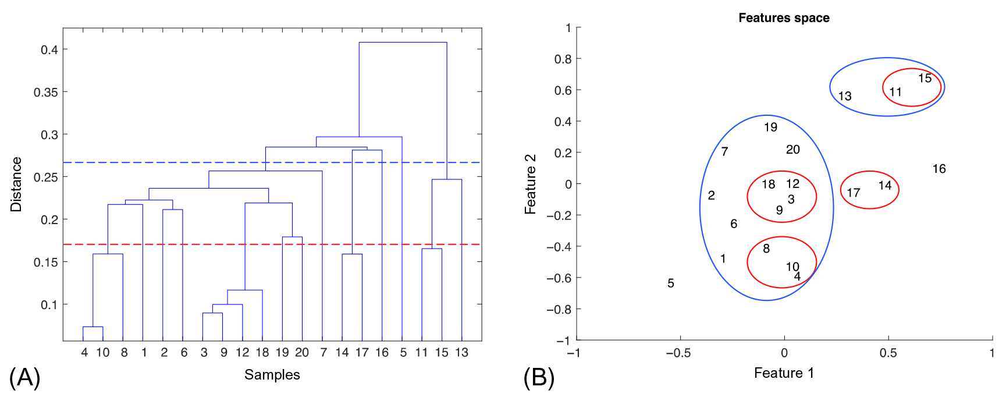
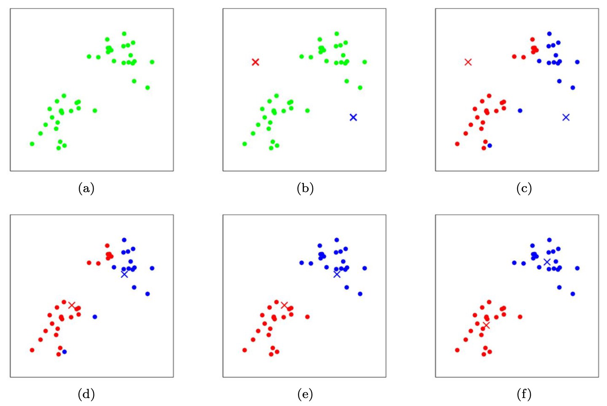

# Practical Tutorial: Clustering
 
For those interested in clustering, and specifically in the most common algorithms, hierarchical clustering and k-means clustering,
here is a practical guide that I think many of you will find useful. It was created during my stay in [Prof. Rainer König lab](https://www.uniklinikum-jena.de/infektionsmedizin/Forschung/Modelling.html) and represents my updated version of the lab's tutorial for the annual R course. My solution for the tasks is provided as an attached .R file. Enjoy!

**1. Introduction**

In the following exercise, we will address methods of hierarchical clustering. Hierarchical clustering leads to a nested structure of clusters: larger clusters contain smaller ones. The smallest cluster contains exactly one object. The conventional function in R applies the agglomerative method. The agglomerative method starts with small clusters, which contain exactly one object (singletons). Each object is assigned to its own cluster. Subsequently, the clusters are merged until the stop criterion is fulfilled.





**2. Data**

The dataset with 4,345 genes and 43 experimental samples is used. It is a real study that investigated the expression of *E.coli*
 in aerobic and anaerobic growth media. For details and the original files, see [*Covert, M.W. et al. (2004). Nature, 429, 92-96*](https://www.nature.com/articles/nature02456). 

For the analysis, download the gene expression table 'covert.withsymbols.log.Dec05.tab' from the repository to your diretory.

**3. Import**

Make sure that the packages “pvclust” and “gplots” are installed. If not, you can install these packages with the function 'install.packages()':
```r
install.packages("pvclust", dependencies = TRUE)
```

Import the packages with the function 'library()':
```r
library(pvclust)
```